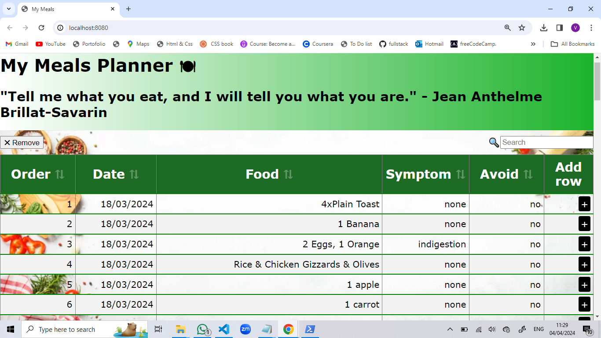

# My Meals

Keep track of your meals! or Plan them in advance!

## Features and Usage

- [x] Teams Networking (CRUD\*) Operations
  - [x] **C**reate
  - [x] **R**ead
  - [x] **U**pdate
  - [x] **D**elete
- [x] Search
- [] Loading mask
- [] Multi remove
- [] Add inbetween
- [x] Live link
- [x] make a scroll table with 10 rows
- [x] command for npm start project="npm run api&npm start"

## Git commands:

- git reset --hard HEAD^ - to reset last commit

## Start (Daily usage)

Start node-API

```sh
cd C:/Products/node-api
npm start
```

start app (run in current project):

```sh
npm start
```

[link ✅](https://sabovoichita.github.io/meals-planner/)



## Steps:

Follow these steps to create the project:

###### **Step 1**: Create new repository on GitHub

###### **Step 2**:Clone the repository on local workspace

<details><summary><b>Details</b></summary>
git clone + Shift&Insert - in GitBash terminal
</details>

###### **Step 3**: Initial Folder Structure

<details><summary><b>Details</b></summary>
open with Visual Studio Code, Add to SRC folder, index.html(with basic layout), style.css(with basic design) and index.js(with a console)
</details>

###### **Step 4**: Initialize project to use Prettier

<details><summary><b>Details</b></summary>
-create .prettierrc file
"touch .prettierrc" - in console
with the following content:
{
  "trailingComma": "none",
  "semi": true,
  "tabWidth": 2,
  "singleQuote": false,
  "printWidth": 120,
  "arrowParens": "avoid"
} 
Prettier Settings:
VSCode:  Manage >  Settings
Search: "Default Formatter" -> Select: "Prettier - Code..."
Search: "Format On Save" -> Check it
Right Click - Format Document With... (configure...)
</details>

###### **Step 5**: Initialize project to use NPM

<details><summary><b>Details</b></summary>
-Install NodeJs
-inside root folder run "npm init -y"
-in package.json file :
    -description-add description of the project
    -author- add name/names
</details>

###### **Step 6**: Initialize project to use Webpack

<details><summary><b>Details</b></summary>
 Install required npm packages- run in console GitBash:
```
npm install --save-dev webpack webpack-cli
npm i -D webpack-dev-server
npm i -D html-webpack-plugin
npm i -D html-loader style-loader css-loader
```
</details>

###### **Step 7**: create webpack.config.js file

<details><summary><b>Details</b></summary>
Add to webpack.config.js:-run in console:"touch webpack.config.js" and add:

const path = require("path");
const HtmlWebpackPlugin = require("html-webpack-plugin");

module.exports = env => {
const isProduction = !!env.WEBPACK_BUILD;
return {
mode: isProduction ? "production" : "development",
entry: ["./src/index.js"],
devtool: isProduction ? false : "inline-source-map",
devServer: {
static: ["src"],
watchFiles: ["src/**/*.*"]
},
plugins: [
new HtmlWebpackPlugin({
template: "./src/index.html"
})
],
module: {
rules: [{
test: /\.html$/i,
        loader: "html-loader"
      }, {
        test: /\.css$/i,
use: ["style-loader", "css-loader"]
}]
},
output: {
filename: "main.js",
path: path.resolve(\_\_dirname, "docs"),
publicPath: ""
}
};
};

</details>

###### **Step 8**: Configure npm scripts

<details><summary><b>Details</b></summary>
Add following scripts inside package.json(only content inside the braces with a comma first):
```
"scripts": {
"clean": "rimraf docs",
"clear": "npm run clean && rimraf node_modules",
"prebuild": "npm run clean",
"build": "webpack --mode production",
"start": "webpack serve --open",
"demo": "set PORT=8080 && serve docs"
}
```
</details>

###### **Step 9**: Start Servers

<details><summary><b>Details</b></summary>
-run ```sh npm start ``` in terminal
<details>

###### **Step 10**: Import style.css and index.js

<details><summary><b>Details</b></summary>
Folder Structure:
📁docs
    index.js
    main.js
📁filenode_modules
📁src
    index.html
    index.js
    style.css
.gitgnore
📄.prettierrc
📄package.json
webpack.config.js

-Delete links to import style.css and index.js from index.html

- in index.js add "import './style.css'"
</details>

###### **Step 11**: Install Global Packages

<details><summary><b>Details</b></summary>
```sh
npm install --global serve
npm i -g rimraf
```
-npm run clean- will remove the DOCS folder
</details>

###### **Step 12**: Running Scripts

<details><summary><b>Details</b></summary>
```sh
npm start
npm run build
npm run demo
```
CTRL + Click in  terminal  to open :
-Local:  http://localhost:8080 or
-Network : https://192.168.68.132:8080
</details>

###### **Step 13**: Create main layout

<details><summary><b>Details</b></summary>
index.html:
<header>
<div id="header-wrapper">
<div id="my-picture">

</div>
<div id="header-info">
<h1>Title</h1>
<h2>Subtitle</h2>
</div>
</div>

</header>
<section>
<button>❌Remove</button>
Table...
</section>
<footer>👨‍💻Source Code</footer>

-npm start

style.css:

html {
height:100%
}

body {
min-height:100%;
margin:0;
display:flex;
flex-direction:column;
background:#something;
}

body > section {
flex:1;
padding:15px
}

footer {
background-color:blue;
color:white;
padding:7px;
}

header {
background: url(images/picture1.png);
}

header img {
border-radius:50%;
border:4px solid #fff;
background-color:#ffffff90;
}

#my-picture {
padding:5px;
width:108px;
height:108px;
}

#header-wrapper {
display:flex;
flex-direction:row;
align-items:center;
background:linear-gradient(45deg, #color, transparent)
}

#header-info {
padding:10px;
text-shadow: 1px 1px 2px #000000;
}

h1 {
color:white;
margin:5px 0;
}

h2 {
color:white;
margin:5px 0;
font-weight:100;
font-size:1.2em;
}

<details>

###### **Step 14**: Create Table & CSS

<details><summary><b>Details</b></summary>
index.html:
<table border="1" id="mealsTable">
        <tr>
          <th>Order <span class="order">&#8645;</span></th>
          <th>Date <span class="order">&#8645;</span></th>
          <th>Time <span class="order">&#8645;</span></th>
          <th>Meal <span class="order">&#8645;</span></th>
          <th>Symptom <span class="order">&#8645;</span></th>
          <th>Avoid <span class="order">&#8645;</span></th>
          <th>Add row</th>
        </tr>
        <tr>
          <td>1.</td>
          <td>18/03/2024</td>
          <td>08:30</td>
          <td>4 x Plain Toast</td>
          <td>None</td>
          <td>No</td>
          <td><span class="plus">&#43;</span></td>
        </tr>
      </table>

style.css:
#mealsTable th,
#mealsTable td {
padding: 5px;
border-right: none;
border-bottom: 2px solid green;
}

#mealsTable {
border-collapse: collapse;
width: 100%;
}
#mealsTable th {
font-size: 1.4rem;
background-color: rgb(29, 106, 37);
color: white;
padding: 10px 5px;
}

.order {
opacity: 0.3;
cursor: pointer;
}

.plus {
background-color: black;
color: white;
padding: 4px;
border-radius: 3px;
align-content: flex-end;
}

#mealsTable tr:nth-child(even) {
background-color:#f2f2f2;
}

</details>

###### **Step 16**: Create teams.json, load them and print them in console

<details><summary><b>Details</b></summary>
```
function loadMeals() {
  fetch("meals.json")
    .then(r => r.json)
    .then(meals => {
      console.warn("meals", meals);
    });
}
loadMeals();
```
-also delete script with index.js from index.html
</details>

###### **Step 17**: Render Meals using String Template

<details><summary><b>Details</b></summary>
```
function getMealAsHTML(meal) {
// console.info("inside map");
return `<tr>
  <td>${meal.order}</td>
  <td>${new Date().toLocaleString()}</td>
  <td>${meal.meal}</td>
  <td>${meal.symptom}</td>
  <td>${meal.avoid}</td>
  <td><span class="plus">&#43;</span></td>
</tr>`;
}
function renderMeals(meals) {
const mealsHTML = meals.map(getMealAsHTML);
document.querySelector("#mealsTable tbody").innerHTML = mealsHTML.join("");
}
meals.json:
[
{ "order": 1, "date": "18/03/2024", "meal": "4xPlain Toast", "symptom": "none", "avoid": "no" },
{ "order": 2, "date": "18/03/2024", "meal": "1 Banana", "symptom": "none", "avoid": "no" },
{ "order": 3, "date": "18/03/2024", "meal": "2 Eggs & 1 Orange", "symptom": "indigestion", "avoid": "no" },
{ "order": 4, "date": "18/03/2024", "meal": "Rice & Chicken Gizzards & Olives", "symptom": "none", "avoid": "no" }
]
```
</details>

###### **Step 18**:Toolbar and Spacer (Remove and Search)

<details><summary><b>Details</b></summary>
style.css: 
.tbar {
  margin-top: 10px;
  margin-bottom: 10px;
  display: flex;
  align-items: stretch;
  flex-direction: row;
}

.tfill {
flex: 1;
}

.tbar label {
padding: 5px;
}
index.html:

<div class="tbar">
        <button>✖ Remove</button>
        <div class="tfill"></div>
        <input type="search" name="search" id="search" placeholder="Search" />
        <label for="search">🔍</label>
      </div>
</details>

###### **Step 19**:Connect to Node-Api

<details><summary><b>Details</b></summary>

#### Install :

```
 git clone https://github.com/sabovoichita/node-api.git
 cd node-api
 npm install
```

#### Usage:

```
npm start
# or(when you work inside the code and want autorestart)
npm run devstart
```

Open http://localhost:3000 to see if it works!
-Modify the node-api with all necesarry data
Create a new repository with "node-api-meals"(if you want)

To Open: SHIFT+ RightClick to Open PoweShell then run npm start to get access to data in the other project

</details>

###### **Step 20**:Connect to Node-Api with the function loadTeams()

<details><summary><b>Details</b></summary>
function loadMeals() {
  fetch("http://localhost:3000/meals-json", {
    method: "GET",
    headers: {
      "Content-Type": "application/json"
    }
  })
    .then(r => r.json())
    .then(meals => {
      renderMeals(meals);
    });
}
</details>

###### **Step 21**:Static form to creat meal

<details><summary><b>Details</b></summary>
style.css:
#mealsTable tfoot input[type="text"] {
  width: 100%;
  box-sizing: border-box;
}

index.html

<form id="mealsForm" method="get">
        <table border="1" id="mealsTable">
          <thead>
            <colgroup>
              <col span="1" />
              <col span="1" />
              <col span="1" />
              <col span="1" />
              <col span="1" />
              <col span="1" style="width: 90px" />
            </colgroup>
            <tr>
              <th>Order <span class="order">&#8645;</span></th>
              <th>Date <span class="order">&#8645;</span></th>
              <th>Food <span class="order">&#8645;</span></th>
              <th>Symptom <span class="order">&#8645;</span></th>
              <th>Avoid <span class="order">&#8645;</span></th>
              <th>Add row</th>
            </tr>
          </thead>
          <tbody></tbody>
          <tfoot>
            <tr>
              <td>
                <input required type="text" name="order" id="order" placeholder="Order" />
              </td>
              <td>
                <input required type="text" name="date" id="date" placeholder="Date" />
              </td>
              <td>
                <input required type="text" name="food" id="food" placeholder="Food" />
              </td>
              <td>
                <input required type="text" name="symptom" id="symptom" placeholder="Symptom" />
              </td>
              <td>
                <input required type="text" name="avoid" id="avoid" placeholder="Avoid" />
              </td>
              <td><button type="submit">✅</button> <button type="reset">❎</button></td>
            </tr>
          </tfoot>
        </table>
      </form>
</details>

###### **Step 22**:Create meal request(function $,createMealRequest)

<details><summary><b>Details</b></summary>
function $(selector) {
  return document.querySelector(selector);
}
function createMealRequest(meal) {
  fetch("http://localhost:3000/meals-json/create", {
    method: "POST",
    headers: {
      "Content-Type": "application/json"
    },
    body: JSON.stringify(meal)
  });
}
function $(selector) {
  return document.querySelector(selector);
}
function onSubmit(e) {
  // console.warn("submit", e);
  e.preventDefault();
  const date = $("input[name = order ]").value;
  const food = $("input[id = food]").value;
  const symptom = $("#symptom").value;
  const avoid = $("#avoid").value;
  const meal = {
    order: $("input[name = order ]").value,
    date: date,
    food: food,
    symptom,
    avoid
  };
  createMealRequest(meal);
  window.location.reload();
  // console.warn(meal);
}
function initEvents(){
$("#mealsForm").addEventListener("submit", onSubmit);

}

initEvents();

</details>

###### **Step 23**:Wait for request to be done before we reload

<details><summary><b>Details</b></summary>
-add return:
function createMealRequest(meal) {
  return fetch("http://localhost:3000/meals-json/create", {
    method: "POST",
    headers: {
      "Content-Type": "application/json"
    },
    body: JSON.stringify(meal)
  }).then(r => r.json());
}
-modify function onSubmit()

function onSubmit(e) {
// console.warn("submit", e);
e.preventDefault();

const date = $("input[name = order ]").value;
const food = $("input[id = food]").value;
const symptom = $("#symptom").value;
const avoid = $("#avoid").value;

const meal = {
order: $("input[name = order ]").value,
date: date,
food: food,
symptom,
avoid
};

createMealRequest(meal).then(status => {
// console.log("status", status);
if (status.success) {
window.location.reload();
}
});
// console.info("ready", r);

// console.warn(meal);
}

</details>

###### **Step 24**:HTML &CSS for Remove Button

<details><summary><b>Details</b></summary>

 <td>
  <button type = "button" class = "action-btn delete-btn">♻</button>
  </td>
  ----
  .action-btn {
  cursor: pointer;
  min-width: 34px;
}
.delete-btn {
  display: none;
  color: #b90303;
}

#mealsTable tr:hover .delete-btn {
display: inline-block;
}

td, th{
line-height:25px;
}

---

</details>

###### **Step 25**:DeleteTeamRequest

<details><summary><b>Details</b></summary>
// DELETE teams-json/delete
function deleteMealRequest(id) {
  return fetch("http://localhost:3000/meals-json/delete", {
    method: "DELETE",
    headers: {
      "Content-Type": "application/json"
    },
    body: JSON.stringify({ id: id })
  }).then(r => r.json());
}
---
data-id="${meal.id}
---
$("#mealsTable tbody").addEventListener("click", e => {
    if (e.target.matches("button.delete-btn")) {
      const id = e.target.dataset.id;
      deleteMealRequest(id).then(status => {
        if (status.success) {
          window.location.reload();
        }
      });
    }
  });

</details>

###### **Step 26**:Add Edit Button + CSS

<details><summary><b>Details</b></summary>
index.html:
class="table-actions"
---
 <button class="action-btn" type="submit">💾</button>
                <button class="action-btn" type="reset">✖</button>
---
index.js:
<button type = "button" data-id="${team.id}" class = "action-btn edit-btn">&#9998;</button>
---
style.css:
.table-actions {
  width: 90px;
}
.edit-btn {
  display: none;
  color: #039903;
}
#mealsTable tr:hover .action-btn {
  display: inline-block;
}

</details>

###### **Step 27**:Update Team Request

## <details><summary><b>Details</b></summary>

index.js:
let editId;
let allMeals = [];

---

const meal = getMealValues();

if (editId) {
meal.id = editId;
// console.warn("should we edit?", editId, meal);
updateMealRequest(meal).then(status => {
// console.warn("status", status);
if (status.success) {
window.location.reload();
}
});
} else {
createMealRequest(meal).then(status => {
// console.warn("status: ?", status);
if (status.success) {
window.location.reload();
}
});
}
}function startEdit(id) {
editId = id;
const meal = allMeals.find(meal => meal.id === id);
console.warn("edit", id, meal);
setMealValues(meal);
}

function setMealValues(meal) {
$("input[name=order]").value = meal.order;
$("input[name=date]").value = meal.date;
$("input[name=food").value = meal.food;
$("input[name=symptom]").value = meal.symptom;
$("input[name=avoid]").value = meal.avoid;
}

function getMealValues() {
const order = $("input[name=order]").value;

---

</details>

###### **Step 28**:fix reset flow (clear editId)

<details>
<summary><b>Details</b></summary>
.console.warn("should we edit?
", editId, meal);
$("#mealsForm").addEventListener("reset", () => {
console.warn("reset", editId);
editId = undefined;
});

</details>

###### **Step 29**:filter elements

<details><summary><b>Details</b></summary>
function filterElements(search) {
  search = search.toLowerCase();
  // console.warn("search %o", search);
  return allMeals.filter(meal => {
    // console.log("meal", meal.symptom === search);
    return (
      // meal.order.toLowerCase().includes(search) ||
      meal.date.toLowerCase().includes(search) ||
      meal.food.toLowerCase().includes(search) ||
      meal.symptom.toLowerCase().includes(search) ||
      meal.avoid.toLowerCase().includes(search)
    );
  });
}
function initEvents() {
  $("#search").addEventListener("input", e => {
    const search = e.target.value;
    const meals = filterElements(search);
    renderMeals(meals);
  });

</details>

###### **Step 30**:make filterElements pure functions

<details><summary><b>Details</b></summary>
function filterElements(meals, search) {
...
  return meals.filter(meal => {
...
const meals = filterElements(allMeals, search);

</details>

###### **Step 31**:inline push new team and rerender all teams

<details><summary><b>Details</b></summary>
<script>
    console.time("app-ready");
  </script>
  ...
  console.timeEnd("app-ready");
  ...
  console.warn("status: ?", status, meal);
...

</details>

###### **Step 32**:live remove team without reload page & add areTeamsEquals function

<details><summary><b>Details</b></summary>
live remove team without reload page:
allMeals = allMeals.filter(meal => meal.id !== id);
renderMeals(allMeals);
...
function areMealsEquals(renderedMeals, meals) {
if (renderedMeals === meals) {
console.info("same array");
return true;
}
if (renderedMeals.length === meals.length) {
const eq = renderedMeals.every((meal, i) => meal === meals[i]);
if (eq) {
console.info("same content in arrays");
return true;
}
}
return false;
}
let renderedMeals = [];
function renderMeals(meals) {
// console.time("eq-check");
if (areMealsEquals(renderedMeals, meals)) {
// console.timeEnd("eq-check");
return;
}
// console.timeEnd("eq-check");
renderedMeals === meals;
console.time("render");
const mealsHTML = meals.map(getMealAsHTML);
$("#mealsTable tbody").innerHTML = mealsHTML.join("");
console.timeEnd("render");

</details>

###### **Step 33**:use array.map to copy new array to new reference

<details><summary><b>Details</b></summary>
allMeals = allMeals.map(meal => meal);
</details>
